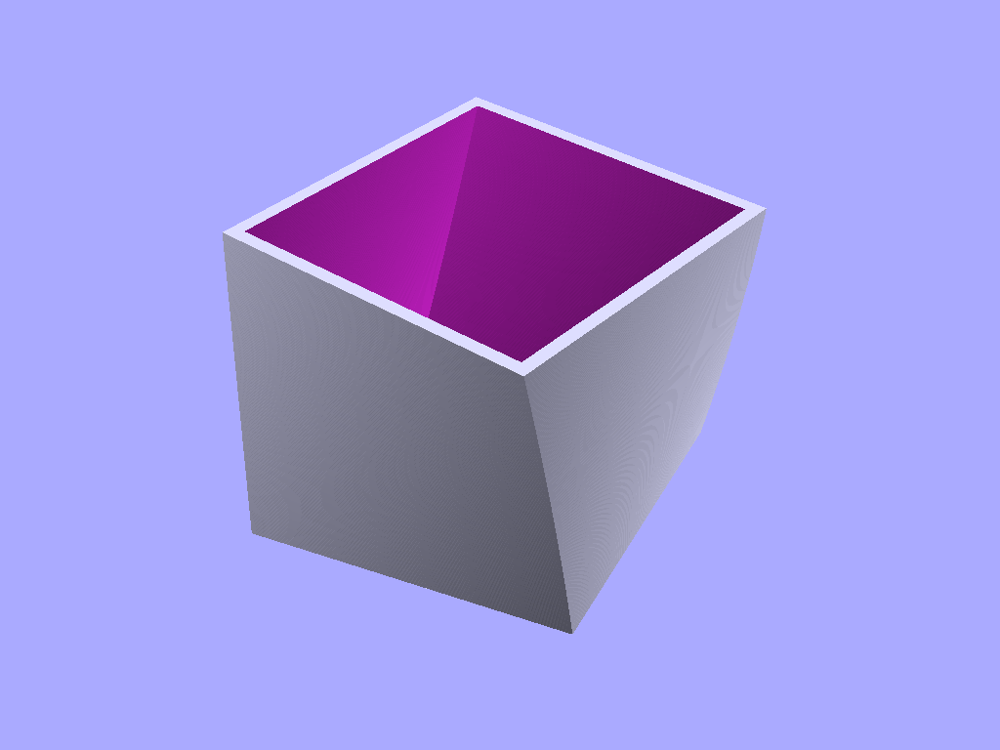

# Things made by Ronoaldo

Designs for printing on 3D printers

I like to write programs and I also like to 3D print.
So, one day I found OpenSCAD and that changed my life:
I could write *code* and get the code to build stuff
on my printer. **Mind blown!!!**

This repository has some of my adventures buliding stuff,
and you can also [download and print them yourself](./MODELS.md).
Either use the *.stl* files provided in the repository,
or even better, install OpenSCAD and use the *.scad* files
to customize before you print!
