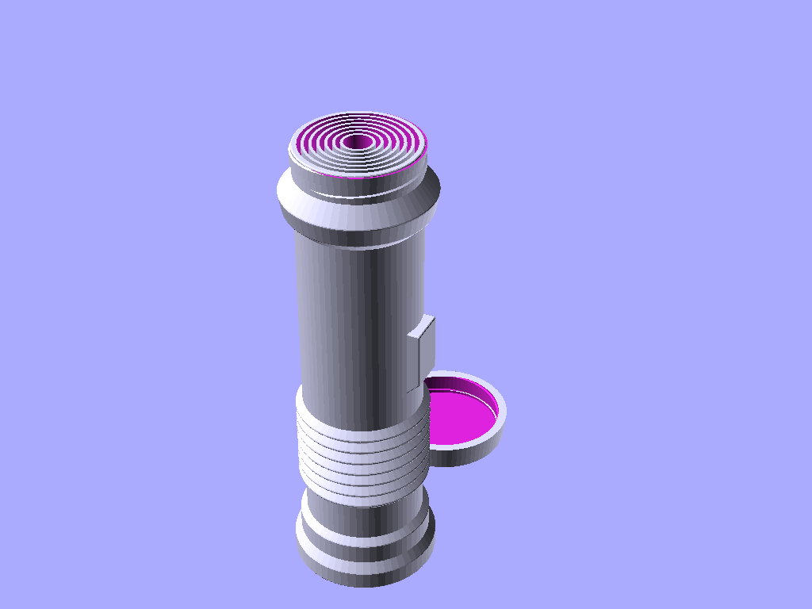

# Customizable Light Saber

This is my implementation of a customizable and collapsible Light Saber, that can be printed in a single go and assembled easily.

Due to how the layers are printed in the saber blades, they are not very strong specially if kids play with them *for real*, and after a few fights it may break. You can reprint only one part of the model with the split function from Mesh Tools cura plugin.

The customization is not simple... But should allow you to scale/resize the model to fit your needs.

## Roadmap

I plan to simplify the options in the customizer, specially after I figure out the best/optimal angle for some sizes. For instance, if you print the blades with non-optimal sizes/distance/radius, it will not properly expand to it's full length.

Also, I plan to make two more lids for the handle:

1. One that can carry a mini-led (to simulate a Kyber crystal), which could make for a more interesting prop as well as a night light.

2. One that let's you bind two sabers togheter, for a dual saber setup.

Finally, I also plan to add some more interesting handles using a set of shape designs, and allow them to be selected from the customizer.

## 3D Printing

To print this part, here are some tips and advices based on my experience:

1. Ensure your **print bed is leveled, and that you have a good adhesion**. Otherwise, the print may fall/break during print

2. Use a **lower layer height** to have the saber expand and collapse easier.

As far as settings, I had great success when printing this with PETG on a Flashforge Finder slicing with Cura:

Another tip is to make the handle lid a bit more strong. I suggest the usage of the Mesh Tools Cura plugin: you can split the model into individual parts, then use the Cura feature **per model settings** and apply these to the lid:

